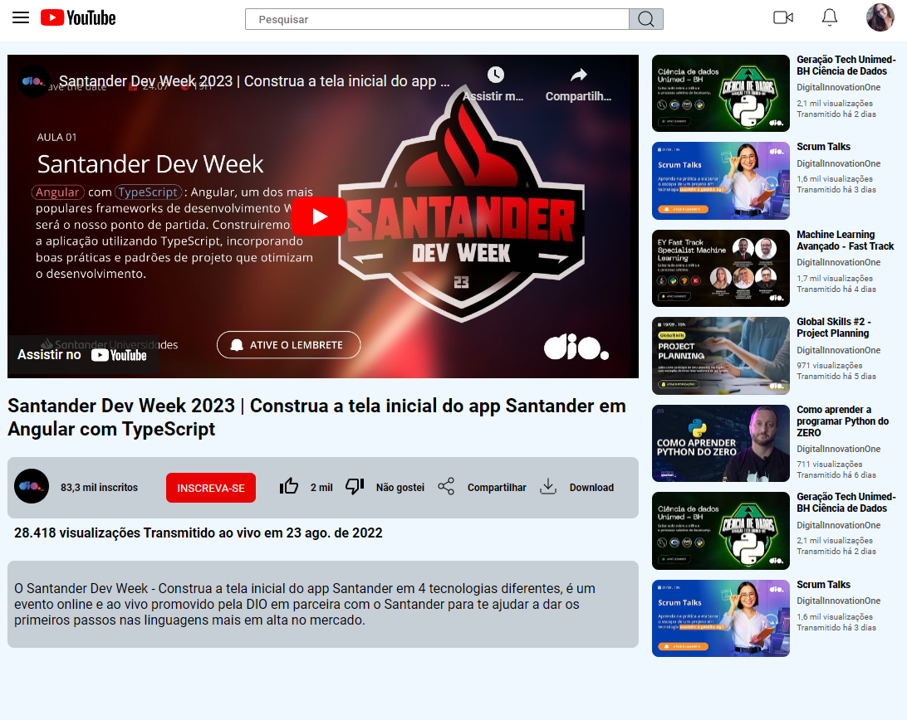

# Clone Pagina Youtube com CSS - Desafio 2

## Por Michele Queiroz Ambrosio

>O objetivo é ensinar os principais conceitos,
aplicações e propriedades que envolvem o Grid layout + Flex Box.

Este desafio utiliza as tecnologias modernas de layout oferecidas pelo CSS, especificamente o Flexbox e o Grid Layout. Aqui estão alguns dos principais conceitos desses modelos de layout:

Grid Layout

1. Transforme um elemento em um contêiner de grade usando `display: grid;`.

2. Itens da Grade (Grid Items):
 Os elementos filhos diretos do contêiner de grade são os itens da grade.

3. Definição de Grade:

Configure as colunas e linhas da grade usando `grid-template-columns` e `grid-template-rows`.

4. Áreas de Grade:

Defina áreas nomeadas na grade para organizar os itens.
`.grid-container {`

`grid-template-areas:`

  `"header header header"`

  `"sidebar content content"`

  `"footer footer footer";`
`}`

Ao combinar Flexbox e Grid Layout de maneira adequada, podemos criar layouts flexíveis e responsivos para quakquer projeto.

## Desafio de Grid Layout

Criação da pagina de listagem do Youtube usando Grid layout CSS.

## Conclusão

O desafio de implementar layouts flexíveis utilizando Flexbox e Grid Layout, a jornada revelou-se estimulante e recompensadora. A combinação desses recursos proporcionou uma abordagem eficiente e elegante para criar designs responsivos e dinâmicos. A compreensão aprofundada dos principais conceitos, incluindo contêineres, itens, eixos, e propriedades específicas, foi essencial para superar obstáculos e alcançar soluções visuais eficazes.

A flexibilidade do Flexbox permitiu a criação de interfaces fluídas, enquanto o poder estrutural do Grid Layout possibilitou a organização intuitiva dos elementos em layouts complexos. A aplicação de shorthands proporcionou uma sintaxe concisa, simplificando a expressão de estilos complexos.

[Link: Clone Youtube 2 😄](https://luizfcs35.github.io/Desafio.CSS-clone.Youtube2/)

